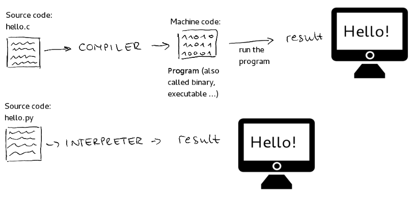
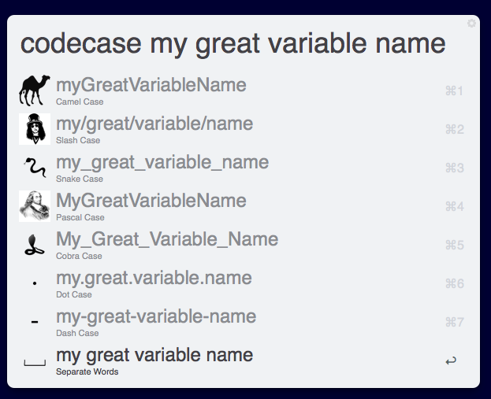

# python section 1

----
- why python
- how to install python
- iterpter vs compiler
- where to code
    - jupyter notebook
    - vscode
- variables assing
    - print variable(basic)
    - variable name in python (pep 8)
    
- basic datatype
    - int
    - float
    - string (just define)
---
## Why Python?
1. Fast to Learn
2. Easy to Code

---   
## how to install python:
1. Download and install from python (main method)
[https://www.python.org/downloads/windows/](https://www.python.org/downloads/windows/)

2. install from anaconda

[https://www.anaconda.com/products/individual](https://www.anaconda.com/products/individual)

---
## Interpreter vs Compiler


#### [Compiler vs Interpreter: Complete Difference Between Compiler and Interpreter](https://www.guru99.com/difference-compiler-vs-interpreter.html)


---
## where to code

###  Jupyter notebook
**[blog post: jupyter notebook guide](https://bigm.ir/jupyter-notebook-guide/)**

**[Video tutorials: jupyter notebook guide](https://www.youtube.com/watch?v=CVyxdu76YjU&list=PLvN40XeLIeJlklwkCSz7RC0FhChKwByCc)**


### vscode

**[vscode website](https://code.visualstudio.com/)**


---

# variables assing

## how to define variable in c++

```c
int x 
```
## in python?
#### realy no need to define empty variable unless you need it.
#### and threre is n't some thing like that:
```python
x
```
### Advance tip:
## if realy need some variable be empty use `None`
```python

x = None
```
---


```python
x = 8
# in jupyter notebook when you put some variable at end 
x
```


    8


 **how to print it? with print function**


```python
y = 10 
print(y)
```

    10


```python
print(x,y)
x
```

    8 10


    8


**help function here is in your service for help!**


```python
help(print)
# usage and param
```

    Help on built-in function print in module builtins:
    
    print(...)
        print(value, ..., sep=' ', end='\n', file=sys.stdout, flush=False)
        
        Prints the values to a stream, or to sys.stdout by default.
        Optional keyword arguments:
        file:  a file-like object (stream); defaults to the current sys.stdout.
        sep:   string inserted between values, default a space.
        end:   string appended after the last value, default a newline.
        flush: whether to forcibly flush the stream.
    


## how to choose variable name?


### .. but how?
1. easy to read
2. meaningful
3. not too long

## Roles:
Here is [PEP-8](https://www.python.org/dev/peps/pep-0008/) about code style.

### codecase



for variables and function use **Snake Case**
```python
i_am_good_variable_name
i_am_good_function_name()
```
for class use **Pascal Case**
```python
IAmGoodNameForYourClass:
    pass
# class sample
```

other sourse: [How to Write Beautiful Python Code With PEP 8](https://realpython.com/python-pep8/)

---


# basic datatype

- int
- float
- string
- complex number (not in this course)
---
## int and basic math opration


```python
a = 10
b = 20
c = -10
# for more readability you can use _ in numbers
d = 1_000_000
print(a,b,c,d)
```

    10 20 -10 1000000


```python
a + d
```


    1000010


```python
d - b
```


    999980


```python
a * b
```


    200


```python
a / b
```


    0.5


```python
a % 3
```


    1


**python like operator**:
`//` and `**`


```python
10 / 3
```


    3.3333333333333335


```python
10 // 3
# like cast 10/3 to int(next chapter)
# int(10 / 3)
```


    3


**power number**


```python
2 * 2
```


    4


```python
2 ** 2
```


    4


```python
2 ** 10
```


    1024


## float 
(there is n't double number just float)


```python
# Area of circle
# pi * (r ** 2)
pi = 3.14
r = 5.7
pi * (r ** 2)
```


    102.0186


**there is some problem you must know**


```python
0.1 + 0.2
```


    0.30000000000000004


### [Floating Point Math and why 0.1 + 0.2 = 0.30000000000000004](https://0.30000000000000004.com/)

## String ( no more char just)
define with:


```python
name = 'hi'
name
```


    'hi'


```python
name = "hi"
name
```


    'hi'


**multi line (and also persian) text in python**


```python
some_text = """
پایتون یک زبان برنامه‌نویسی شیءگرا، تفسیری، سطح بالا، و همه منظوره است، که خیدو فان روسوم آن را طراحی کرده‌است، و اولین بار در سال ۱۹۹۱ منتشر شده‌است. 

فلسفه اصلی طراحی پایتون «خوانایی بالای کد» است و نویسه‌های فاصله خالی در آن معنادار هستند و مکرر استفاده می‌شوند.

"""
print(some_text)
```

    
    پایتون یک زبان برنامه‌نویسی شیءگرا، تفسیری، سطح بالا، و همه منظوره است، که خیدو فان روسوم آن را طراحی کرده‌است، و اولین بار در سال ۱۹۹۱ منتشر شده‌است. 
    
    فلسفه اصلی طراحی پایتون «خوانایی بالای کد» است و نویسه‌های فاصله خالی در آن معنادار هستند و مکرر استفاده می‌شوند.
    
    


```python

```
